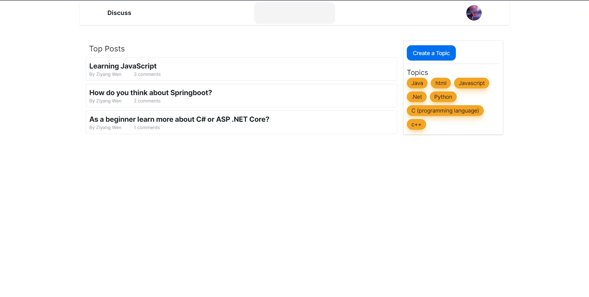

# Forum Application

## Project Description

This is a [Next.js](https://nextjs.org/) project like reddit for discussing technical topics, with functions such as authentication, creating topics and posts, commenting, replying to a post.

### UI Overview

Here's a glimpse of the Application.

_HomePage of the application_

## Technical Stack

This application utilizes several modern web technologies, including:

- **React (with Hooks)**: Used for building the user interface and handling component state and side effects.
- **Next.js**: A React framework that enables functionality such as server-side rendering and generating static websites for React-based web applications. It offers efficient routing and built-in CSS support.
- **Prisma**: It serves as an ORM (Object-Relational Mapper) for TypeScript, simplifying database queries and migrations.
- **TailwinCSS**: Utilized for writing CSS in JavaScrip, enabling a more compositional approach to styling without leaving the HTML.
- **NextUI**: Provides many useful components.
- **Next Auth**: A complete solution for adding authentication and authorization to this applications.

## Installation and Running

Firstly, install dependency and set up database:

```bash
npm install
npx prisma init --datasource-provider sqlite
npx prisma migrate dev
```

Open [https://github.com/settings/applications/new](https://github.com/settings/applications/new) to Register your new OAuth application.

Then, create a file with name .env.local, and set up your OAuth Information like below:

```
GITHUB_CLIENT_ID=""
GITHUB_CLIENT_SECRET=""
AUTH_SECRET=""
```

Finally, run the project:

```bash
npm run dev
```

Open [http://localhost:3000](http://localhost:3000) with your browser to see the result.

You can start editing the page by modifying `app/page.tsx`. The page auto-updates as you edit the file.

This project uses [`next/font`](https://nextjs.org/docs/basic-features/font-optimization) to automatically optimize and load Inter, a custom Google Font.

## How to Contribute

Contributions to this project are always welcome. Here's how you can help enhance its features or make improvements:

### Fork the Repository

Start by forking the project repository, then clone your fork using:

```bash
git clone https://github.com/Zane-007/The-Wild-Oasis.git
```

### Create a New Branch

It's recommended to create a new branch for each feature or fix:

```bash
git checkout -b name-of-your-new-branch
```

### Make Your Changes

Implement your desired modifications or additions to the code.

### Commit Your Changes

Once done, save your changes:

```bash
git commit -m "Provide a brief description of your changes here"
```

### Push to Your Branch

Push your updates to your branch:

```bash
git push origin name-of-your-new-branch
```

### Open a Pull Request

Navigate to the original project repository on GitHub and submit a pull request. Ensure you give a detailed explanation of the changes you've made.

Your contribution will be reviewed, and if it meets the project's standards and objectives, it'll be merged. Thanks in advance for your effort and input!

## Contact Me

If you have questions or wish to discuss the project further, don't hesitate to reach out:

- **Email:** [wenziyang007@gmail.com](mailto:wenziyang007@gmail.com)

I'm always open to feedback, collaboration, or general inquiries. Looking forward to hearing from you!
